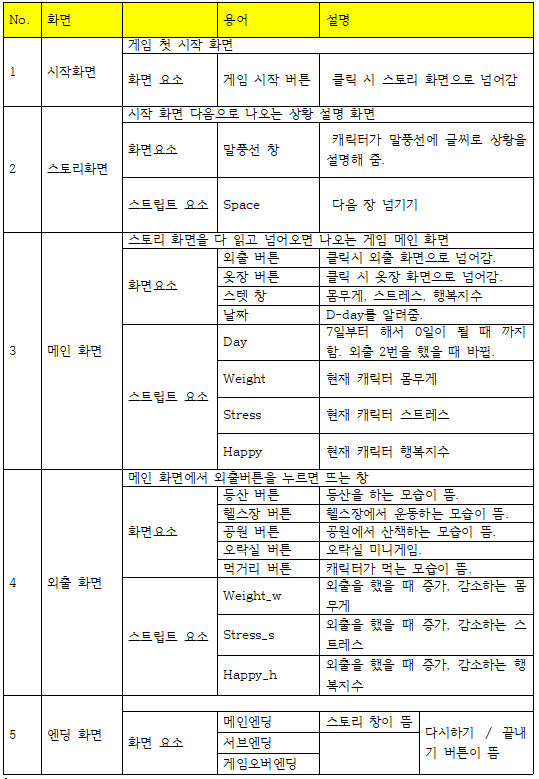

# 프로젝트명: Health me! 공주님
- 게임을 한 문장으로 말하면 "심플 시뮬레이션 게임" 이다.

# [ 목차 ]
### 1. [컨셉](#컨셉)
### 2. [관련 이미지](#관련-이미지)
### 3. [대표 이미지](#대표-이미지)
### 4. [컨셉과 대표이미지 기반 작품 묘사](#컨셉과-대표이미지-기반-작품묘사)
### 5. [게임 구성 요소](#게임-구성-요소)
### 6. [게임 시스템 디자인](#게임-시스템-디자인)
- #### a. 게임 오브젝트 분해
- #### b. 파라미터(속성)
- #### c. 행동
- #### d. 상태
- #### e. 플레이어 캐릭터 속성(파라미터)
- #### f. 게임의 규칙
- #### g. 게임에서 사용될 
### 7. [요구사항 & 흐름도](#요구사항과-흐름도)
- #### a. 요구사항(1년 / 6주)
- #### b. 키보드 이벤트에 대한 흐름도
- #### c. 용어정리
### 8. [개발작업 일정(6주)](#개발작업-일정-6주)
### 9. [개발작업 1주차](#개발작업-1주차)
### 10. [개발작업 2주차](#개발작업-2주차)
### 11. [개발작업 3주차](#개발작업-3주차)
### 12. [개발작업 4주차](#개발작업-4주차)
### 13. [개발작업 5주차](#개발작업-5주차)

# [컨셉]

## 메인컨셉 : 다이어트

- 목표 몸무게 100kg -> 50kg 로 감량하는 게임

### 서브 컨세 1 : 스토리

- 시뮬레이션 게임인 만큼 스토리진행이 가장 중요하게 생각됌.
- 엔딩은 많지않게 실패 or 성공
- 첫 시작과 엔딩에 여러장의 그림 삽입을 통해 스토리를 설명.

### 서브 컨세 2 : 활동

- 다이어트를 해야하므로 밖에서 운동을 할 수 있는 장소를 여러 곳이 필요함.
- 운동 장소에 따라 몸무게와 스트레스는 랜덤으로 부여된다.
- 스트레스가 100%가 되면 게임 오버.

### 서브 컨세 3 : 일주일

- 일주일 다이어터, 단기간 다이어트 프로젝트로써 주어진 시간은 D-7일이다.
- 짧고 간단하게 할 수 있는 게임이다.

### 서브 컨세 4 : 옷장

- 다이어트만 하면 재미가 떨어지므로 옷장이라는 시스템을 통해 특정 몸무게가 되면 여러 옷들을 개방할 수 있음.
- 옷입히기

### 서브 컨세 5 : 더빙
 
- 대부분의 시뮬레이션 게임은 더빙이 들어가 있으며 사운드가 있기에 덜 심심하여 클릭시 여러 대사가 나옴. 혹은 특정 몸무게가 되었을 때, 새로운 옷을 입힐힐 시 에 목소리를 추가함. (+배경음악)

  

# [관련 이미지]

- 관련 이미지  
  
  
  

# [대표 이미지]

# [컨셉과 대표이미지 기반 작품묘사]

> ### 대표이미지 기반 : 7일 이라는 시간을 갖고 게임이 시작되며, 외출의 3가지(등산, 공원, 헬스장)를 통해 스트레스를 신경쓰며 몸무게를 감량하는 게임이다. 스트레스가 100%이 쌓이지 않게, 행복지수가 -(마이너스)가 되지 않도록 조절해야된다.

> ### 컨셉 기반: 여러 엔딩을 보는 시뮬레이션 게임이다.

  

# [게임 구성 요소]

 

## 1. 메커니즘

[도전 과제]

1. 활동을 통해 몸무게 100kg -> 50kg 대로 감량하여라
2. 스트레스가 100%가 쌓이지 않게 해라
3. 행복지수가 -(마이너스)로 떨어지지 않게 해라

[재미 요소]

1. 실제로는 힘든 다이어트를 게임 내에서 몸무게 앞자리가 금방 바뀌면서 캐릭터가 변하는 모습을 보며 쾌감을 느낄 수 있다.
2. 스토리가 있어 엔딩에 대해 흥미를 더 느낄 수 있다.
3. 몸무게, 스트레스, 행복지수가 있어 이것에 대해 신경을 써야되므로 게임을 더 집중할 수 있다.

## 2. 이야기

[만들게 된 배경]  
 게임 외에도 그림을 그리는거에 관심이 있어서, 그림과 밀접한 게임이 뭐가 있을까 생각하다가 시뮬레이션 게임이 생각났습니다. 시뮬레이션에서는 스토리가 중요하다 생각하여 뻔한 스토리보다는 다이어트를하는 공주님이라는 소재자체가 재밌을거 같아서 택하게 되었습니다.

[카메라 관점]  
 2D의 3인칭 시점.

## 3. 미적요소

[디자인][컬러]  
캐릭터 : 게임 시작과 동시에 보이는 것은 캐릭터이기 때문에 캐릭터의 상태를 자세하게 표현을 해 플레이어에게 몰입감과 더불어 변화하는 캐릭터의 모습을 보며 성취감을 줍니다.

옷장 : 캐릭터의 옷을 바꿀 수 있는 기능을 넣음으로써 게임을 하는 플레이어의 시각적 재미 요소를 더했다.

배경 : 배경은 그림이 아닌 사진을 통해서 이미지화 시켜 현실감이 느껴질 수 있도록 한다.

UI : 공주님이라는 타이틀에 맞춰 버튼을 아기자기하게 디자인 할 것이다.

[음향]  
배경 음악 : 무료음악 중에 발랄하고 상쾌한 느낌을 갖은 음악으로 다운을 받아 사용할 것이다.

캐릭터 대사 : 중간 중간에 말풍선에 있는 대사를 더빙을 통해 더 전달력이 있게 표현한다.

효과음 : 아이콘 클릭 시 효과음

## 4. 기술

유니티 2D 

 

# [게임 시스템 디자인]
# 1. 게임 오브젝트 분해 

|연번|오브젝트 이름|오브젝트 이미지|
|:----:|:----:|:----:|
|1|캐릭터||
|2|외출(등산, 헬스장, 공원, 오락실, 먹거리)||
|3|옷장||

# 2. 파라미터(속성) 뽑아 보기
1)오브젝트 이름 : 캐릭터

|속성|영문명칭|설명|
|:----:|:----:|:----:|
|이름|Name|캐릭터 이름|
|나이|Age|캐릭터의 나이|
|키|Height|캐릭터 키(cm)|
|몸무게|Weight|캐릭터 몸무게(kg)|
|스트레스|Stress|캐릭터가 스트레스를 받는 퍼센트(%)|
|행복지수|Happy|캐릭터의 행복지수(%)|

2)오브젝트 이름: 외출(등산, 헬스장, 공원, 오락실, 먹거리)

|속성|영문명칭|설명|비고|
|:----:|:----:|:----:|:----:|
|등산|Hiking|외출의 한 가지 운동종류, 몸무게(-), 스트레스(+), 행복지수(-)에 영향을 준다.|몸무게 -2kg, 스트레스 +10kg, 행복지수 -3%|
|헬스장|PT|외출의 한 가지 운동종류, 몸무게(-), 스트레스(+), 행복지수(-)에 영향을 준다.|몸무게 -4kg, 스트레스 +20kg, 행복지수 -5%|
|공원|Park|외출의 한 가지 운동종류, 몸무게(-), 스트레스(+), 행복지수(-)에 영향을 준다.|몸무게 -2kg, 스트레스 +10kg, 행복지수 -3%|
|오락실|Game|외출의 한 가지 취미종류, 스트레스(-), 행복지수(+)에 영향을 준다.|몸무게 0kg, 스트레스 -10kg, 행복지수 +20%|
|먹거리|Food|외출의 한 가지 취미종류, 몸무게(+), 스트레스(-), 행복지수(+)에 영향을 준다.|몸무게 +3kg, 스트레스 -20kg, 행복지수 -10%|

3) 오브젝트 이름: 옷장

|속성|영문명칭|설명|
|:----:|:----:|:----:|
|옷|Clothes|여러 옷들|

# 3. 행동 뽑아보기
1) 오브젝트 이름: 캐릭터
 
|행동|설명|
|:----:|:----:|
|외출|외출을 하여 몸무게, 행복지수, 스트레스를 얻거나, 잃는다.|
|옷장|옷을 행복지수에 따라 여러 갈아 입는다..|

# 4. 상태 뽑아보기
1) 오브젝트 이름: 캐릭터

|현상태|전이상태|전이조건|
|:----:|:----:|:----:|
|건강 위험 상태|건강 상태|몸무게 감소 (최소 –20 ~ -50kg 감소했을 때)|
|평범한 상태|행복 상태|행복지수 증가 (50% ～ 100% 사이에 있을 때)|
|평범한 상태|행복 상태|행복지수 감소 (-1% ~ - 10 % 사이에 있을 때)|
|스트레스 없는 상태|스트레스 받은 상태|스트레스 증가 (50% ~ 100% 사이에 있을 때)|

# 5. 플레이어 캐릭터 속성(파라미터)

|속성|영문명칭|설명|
|:----:|:----:|:----:|
|몸무게|Weight|캐릭터 몸무게는 100kg를 갖고 시작한다. 몸무게 감소할 수 있는 방법은 외출 뿐이다. |
|스트레스|Stress|스트레스는 외출시 운동을 하게 되면 증가된다. 감소를 하려면 외출의 오락실, 먹거리를 통해 감소 시킬수 있으며, 다음 날이 되면 –5%가 감소한다.)|
|최대 스트레스|MaxStress|스트레스가 100%가 되면 게임 종료된다.|
|행복지수|Happy|행복지수는 외출할 때 운동(등산, 헬스장 공원)을 하면 행복지수가 감소고, 오락실, 먹거리를 통해 행복지수를 회복시킬 수 있다.|
|최소 행복지수|MinHappy|행복지수 –100%가 되면 게임 종료된다.|
|날짜|Day|D-7, 외출 2번을 하면 하루가 지난다. 7일이 지나면 게임이 종료가 된다.|

# 6.게임 규칙
1) 핵심 규칙
 게임이 끝나려면 몸무게에 상관없이 D-day 7일이 지나야된다.
2) 보조규칙
 7일이 지나지 않았지만 게임이 끝나는 경우는 스트레스가 100%가 되었을 때, 행복지수가 100% 돼었을 때이다.

# 7. 게임에서 사용될 공식
만약 스트레스(행복지수)가 100%이상 되면 
  게임오버된다.
 엔딩칭을 띄운다.

# [요구사항과 흐름도]
# 1. 요구사항
### 6개월차
### 1) 디자인: 각 화면들의 그림 및 사진 편집 
1. 게임 첫 화면을 지난 게임 스토리 장면 2장의 그림
2. 메인 화면의 배경과 캐릭터 그림 
3. 외출화면의 사진과 그 사진의 편집 
4. 외출화면에서의 버튼들을 클릭했을 때 뜨는 그림 5장 

### 2) 디자인: 버튼  
1. 게임 첫 화면에서의 버튼 
2. 메인 화면에서의 오른쪽 하단에 옷장, 외출 버튼
3. 외출화면에서의 산, 헬스장, 공원, 오락실, 먹거리 버튼
4. 외출 화면에서의 돌아가기 버튼

### 3) 프로그래밍
 1. 각 버튼마다 화면 변경
 1. 첫 화면 게임시작 버튼을 눌러 스토리 창에 왔을 때 스토리 창 넘기기 (스페이스바)
    1. 엔딩(캐릭터가 데이트하는 모습)의 스토리 창 넘기기
 1. 스토리창이 서서히 검은 창으로 변하며 메인화면 등장 (페이트 효과주기)
    1. 외출에서 각 버튼(산, 헬스장, 공원, 오락실, 먹거리)을 눌렀을 때, 행동이 끝났을 때 
    1. 엔딩(캐릭터가 데이트하는 모습, 과로한 모습, 행복한 모습)이 뜰 때
    1. 외출 2번을 했을 때 메인 화면으로 돌아올 때     
1. 외출에서 각 버튼(산, 헬스장, 공원, 오락실, 먹거리)의 몸무게, 스트레스, 행복지수 감소, 증가 
1. 외출 2번을 마친 후, 다음 날로 변경 (D-7 => D-6) 6. 외출 2번을 마친 후, 다음 날이 왔을 때 스트레스 –10% 
1. 엔딩 
   1. D-7 이라는 시간이 다 흘렀을 때
   1. 스트레스 100% 됐을 때
   1. 행복지수 100% 됐을 때
   
 ### 12개월차
 1. 옷장 시스템
    1. 메인화면에 외출버튼을 클릭 했을 때 몸무게 별 입을 수 있는 옷 종류 3가지
    1. 85kg 이하, 65kg, 55kg 일 때 잠금되어 있던 옷이 풀려 입을 수 있다.

1. 더빙 시스템
   1. 처음으로 메인화면에 들어 올 때 “안녕!”  
   1. 스트레스가 30% , 50% , 80%이상 쌓였을 때 “아.. 짜증나..” / “으... 진짜 싫어..” / “(한숨을 쉰다)”
   1. 진 엔딩(캐릭터가 데이트하는 모습) 일 때 스토리 창 읽어줌.
    
1. 저장 / 불러오기 시스템

# 2. 키보드 이벤트에 대한 흐름도

# 3. 용어정리

# [개발작업 일정 6주]
  

# [개발작업 1주차]
작업명 : 게임의 각 배경화면 디자인

해당 요구사항:
1. 게임 첫 화면
2. 메인화면
3. 외출화면

작업 내용 :
1. 게임 첫 화면의 배경과 게임 시작버튼 활성화 -> X
2. 게임 첫 화면을 지나 게임 스토리 장면 2장 -> X
3. 메인 화면의 배경과 캐릭터 그림 -> 메인화면 O , 캐릭터 색체 X
4. 외출화면의 사진과 그 사진의 편집 -> O
5. 외출화면에서의 버튼들을 클릭했을 때 뜨는 그림 5장 -> 5장 중 1장 완성

작업 결과 :
1. 게임 첫 화면의 배경과 게임 시작버튼 활성화
2. 게임 첫 화면을 지나 게임 스토리 장면 2장  
3. 메인 화면의 배경과 캐릭터 그림
4. 외출화면의 사진과 그 사진의 편집
5. 외출화면에서의 버튼들을 클릭했을 때 뜨는 그림 5장

메인 배경 화면

캐릭터

외출 화면

외출 중 등산  

# [개발작업 2주차]
작업명 : 화면만들기

해당 요구사항 : 
1. 각 버튼마다 화면 변경 

작업 내용 : 
1. 게임 배경화면 만들기 
2. 배경화면별로 넘어가는 버튼 만들기

1. 1주차에 못했던 부분들 마무리
    1. 게임 첫 화면을 지난 게임 스토리 장면 2장의 그림
    1. 게임 첫 화면과 첫 화면에서의 ‘게임시작버튼’ 활성화
    1. 외출화면에서의 버튼들을 클릭했을 때 뜨는 그림 5장 중 남은 4장

작업 결과 :
1. 게임 배경화면 만들기 -> X
2. 배경화면별로 넘어가는 버튼 만들기 -> X

1. 1주차에 못했던 부분들 마무리
    1. 게임 첫 화면을 지난 게임 스토리 장면 2장의 그림 -> X
    1. 게임 첫 화면과 첫 화면에서의 ‘게임시작버튼’ 활성화 -> X
    1. 외출화면에서의 버튼들을 클릭했을 때 뜨는 그림 5장 중 남은 4장 -> 4장 중 2장 완성

외출 중 공원

외출 중 헬스장
 
 # [개발작업 3주차]
 작업명 : 화면만들기

해당 요구사항 : 
1. 각 버튼마다 화면 변경 

작업 내용 :
1. 게임 배경화면 만들기 
1. 1주차에 못했던 부분 마무리
    1. 게임 첫 화면과 첫 화면에서의 ‘게임시작버튼’ 활성화
    1. 캐릭터 색넣기

1. 2주차에 못했던 부분 마무리
    1. 외출 버튼으로 화면 변경

 
작업 결과: 
1. 유니티 2D에 사진 첨부 
2. 메인화면에서의 버튼 넣고 실행 (메인화면->외출화면)

 # [개발작업 4주차]
 작업명 : 게임 스텟 생성
 해당 요구사항 :
 1. 스텟 설정하기 (외출 시스템 구축)
 2. 각 버특마다 화면 변경
 3. 버튼 디자인

작업 내용 : 
1. 외출 시스템에 있는 산, 공원, 헬스장, 오락실, 먹거리에 해당하는 스텟(몸무게, 스트레스, 행복지수)을 설정하여 게임에 실행되게 한다.
1. 각 버튼(시작화면의 “게임시작” 버튼, 외출에 돌아가기 버튼과 산, 공원, 헬스장, 오락실, 먹거리 버튼 만들기)마다 화면 전환.
1. 버튼의 디자인 만들기.
1. 3주차 떄 못했던 것 마무리
    1. 게임 처음 시작하면 만들기
    1. 스토리 화면 디자인
    1. 메인 화면 날짜와 스텟 넣기

작업 결과 : 
1. 버튼 활성화
2. 버튼 효과 주기
3. 게임 첫 시작화면 
4. 메인 화면 날짜, 스텟 UI
 

 # [개발작업 5주차]
작업 명 : 프로그래밍
해당 요구사항 :
1. 프로그래밍

작업내용 :
1. 스텟조정
2. 날짜변경
3. 전체적으로 디자인 마무리하기.

작업 결과 :
1. 스텟조정 -> 20%
2. 날짜변경 -> 20%
3. 전체적으로 디자인 마무리하기. -> 0%

### Fade.cs
using System.Collections;
using System.Collections.Generic;
using UnityEngine;
using UnityEngine.UI;
using UnityEngine.SceneManagement;
using System;

public class Fade : MonoBehaviour
{
    public UnityEngine.UI.Image fade;
    float fades = 1.0f;
    float time = 0;
    
    public void T()
    {
        Time.timeScale = 0;
    }
   
    public void Update()
    {
        
        time += Time.deltaTime;
        if (fades > 0.0f && time >= 0.2f)
        {
            fades -= 0.1f;
            fade.color = new Color(0, 0, 0, fades);
            time = 0;
        }

        else if (fades <= 0.0f)
        {
            Time.timeScale = 0;

            time += Time.fixedDeltaTime;
            if (time >= 7.0f)
            {
                Time.timeScale = 1;
                SceneManager.LoadScene(2);
                time = 0;
            }

        }

    }

}
